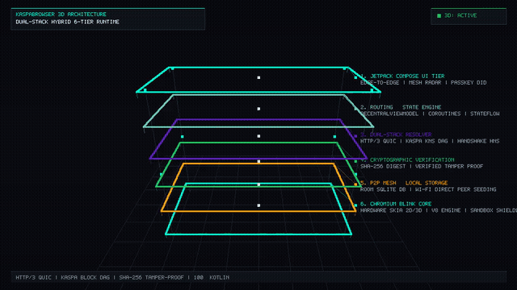
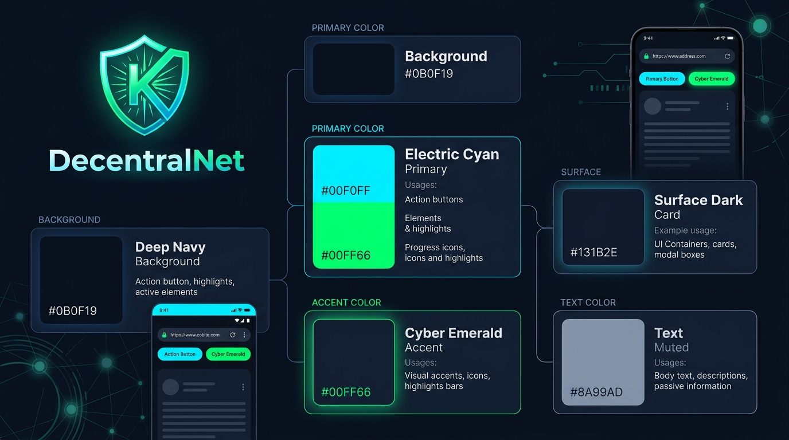

# Kaspa Browser

<p align="left">
  
  
  
  
  
  
  
</p>

**Kaspa Browser** is a privacy-first, decentralized Android web browser and Web3 gateway designed to seamlessly bridge standard web browsing with peer-to-peer decentralized technologies and the Kaspa network ecosystem. Built with **Kotlin (98.5%)**, native **Rust (1.5%)** for high-performance JNI search & privacy sanitization, and **Jetpack Compose (Material 3)**, it unifies standard web browsing, decentralized peer-to-peer mesh discovery, cryptographic identity management, on-device local node hosting, and high-performance Web3 browsing into a fast, privacy-first mobile client.

---

## System Architecture & Visual Overview

<p align="center">
  <a href="architecture_3d_overview.mp4" title="Click to open full MP4 Video Player">
    
  </a>
</p>

<p align="center">
  <a href="architecture_3d_overview.mp4">
    
  </a>
  &nbsp;
  <a href="architecture_diagram.jpg">
    
  </a>
  &nbsp;
  <a href="architecture_3d_overview.gif">
    
  </a>
</p>

<p align="center">
  <sub>🎬 <b>Click the preview above or the badge to play the high-definition 60 FPS MP4 video directly in GitHub's media player.</b></sub>
</p>

---

---

## ✨ Newly Added Production Features

1. **Unified Settings & Privacy Hub (`TrafficAuditScreen.kt`)**:
   - Centralized management console combining network audits, privacy toggles, search engine preferences, and security settings into a single clean Material 3 screen.

2. **HTTPS-Only Mode Enforcement**:
   - Automatically intercepts and upgrades all unencrypted `http://` requests to secure `https://` before network transmission.

3. **Incognito & Strict Decentralized Modes**:
   - **Incognito Mode**: Prevents global persistence of history, cookies, and web storage.
   - **Strict Decentralized Mode**: Blocks all unencrypted centralized Web2 traffic, forcing P2P and encrypted mesh routing.

4. **WebAuth & FIDO2 Passkey Support**:
   - Full support for hardware security keys and biometric Passkeys in the Chromium container, enabling secure, passwordless authentication.

5. **One-Tap Browsing Data & Cache Purge**:
   - Instantly wipes browser history (`Room`), system cookies (`CookieManager`), and web storage (`WebStorage`) securely.

6. **Advanced Kaspa Tracker & Ad Blocker**:
   - Real-time interception of advertising scripts, analytics beacons, and tracking pixels with live statistics and blocked request logs.

7. **Native Download Manager Integration**:
   - Seamless file downloads using Android's native `DownloadManager` with notification tracking and automatic file handling.

---


## Browser Rendering Engine & Gateway Architecture

KaspaBrowser is built on top of a **Dual-Stack Hybrid Rendering Engine**. It combines Android's hardware-accelerated Blink/Chromium WebCore with custom protocol interception layers, decentralized domain resolvers, native ARM64 Rust v9 JNI modules, and privacy content shields.

### 🏛️ Main Rendering Engine Breakdown

| Component / Screen | Main Rendering Engine | Technical Explanation |
| :--- | :--- | :--- |
| **General Web Pages** *(e.g. YouTube, news sites, web apps)* | **Android System WebView (Chromium/Blink)** | Renders third-party websites with 100% HTML5, CSS3, JavaScript, WebGL, and video playback compatibility. |
| **Search Results Screen** | **Jetpack Compose + Native Rust v9 JNI Layer** | Search queries execute through native Rust v9 (`libkaspasearch.so`), returning cards rendered with Jetpack Compose. |
| **Kaspa Reader Mode & Text Views** | **Jetpack Compose + Rust AST Sanitizer** | Rust strips ads and trackers from the HTML; Jetpack Compose renders the clean article layout natively. |
| **Browser UI & Navigation** | **Jetpack Compose + Android GPU (Skia)** | Address bar, tab bar, settings, mesh radar, and dialogs are rendered using Jetpack Compose and Skia hardware acceleration. |

### Engine Specifications
- **Core Rendering Engine**: Android System WebView (Chromium/Blink WebCore with V8 JavaScript engine & Skia 2D rendering).
- **Native Rust v9 JNI Module**: Native Rust engine (`libkaspasearch.so`) performing zero-tracking federated search (DuckDuckGo, Bing, Wikipedia), AST ad/tracker filtering, and URL parameter sanitization.
- **Protocol Interception Layer**: Custom `WebViewClient` request interceptor (`shouldOverrideUrlLoading` & `shouldInterceptRequest`) catching Web3 protocols (`ipfs://`, `kas://`, `mesh://`, `dweb://`, `.kas`, `.hns`, `.eth`, and P2P CID targets).
- **Network Pipeline**: Asynchronous OkHttp3 client with pure **HTTP/3 (QUIC over UDP)** transport layer, 0-RTT handshakes, zero head-of-line blocking, and connection migration (HTTP/2 removed).
- **Decentralized DNS Engine**: Multi-chain DoH & ledger resolver querying Handshake (HNS) PoW root chain, Kaspa Block DAG (KNS), ENS (.eth), EmerDNS, and OpenNIC directly.
- **Cryptographic Verification Engine**: Local in-browser SHA-256 message digest calculator certifying incoming payload streams as `VERIFIED_TAMPER_PROOF` and blocking tampered packets.
- **Local Mesh Seeding Engine**: Room SQLite database engine (`AppDatabase` / `ContentDao`) storing content-addressed blocks with `isSeeding = true` for peer mesh seeding and zero single point of failure during server outages.
- **JavaScript & Web3 Bridge**: `@JavascriptInterface` bridge enabling zero-knowledge account identity injection, Web3 dApp RPC calls, and secure cryptographic signing without exposing private keys.
- **Privacy & Content Shield Engine**: Real-time URL blocklist evaluator inspecting incoming DOM resources against ad-trackers and telemetry scripts before passing sanitized streams into the rendering pipeline.

---

## 🔄 End-to-End Connection & Flow Diagram

The following diagram illustrates how user input, network resolution, peer discovery, protocol fallback, and DOM rendering flow through the KaspaBrowser subsystems:

```
+--------------------------------------------------------------------------------------------------------+
|                                    USER INTERFACE (Jetpack Compose)                                    |
|   [ URL / Search Bar ]   [ Tab Manager ]   [ Mesh Radar ]   [ Privacy Audit ]   [ Account DID Pill ]   |
+--------------------------------------------------------------------------------------------------------+
                                                    |
                                          (User Action / Query)
                                                    v
+--------------------------------------------------------------------------------------------------------+
|                                       VIEWMODEL & ROUTING STATE                                        |
|                               DecentralViewModel (StateFlow / Coroutines)                              |
+--------------------------------------------------------------------------------------------------------+
                                                    |
                                                    v
+--------------------------------------------------------------------------------------------------------+
|                                      DUAL-STACK RESOLVER & ROUTER                                      |
|                                         (DualStackResolver.kt)                                         |
+--------------------------------------------------------------------------------------------------------+
         |                           |                               |                           |
 (Search & AST Sanitizer)     (Standard Web)            (Decentralized CIDs/TLDs)        (P2P Mesh Host)
  Queries & Reader Mode     http:// or https://         .hns / .kas / .eth / ipfs://    Local Node Host
         |                           |                               |                           |
         v                           v                               v                           v
+-----------------------+   +---------------------+   +-------------------------+   +--------------------+
|    NATIVE RUST v9     |   |    HTTP/3 (QUIC)    |   | Handshake / Kaspa / ENS |   | Local Node Manager |
|      JNI ENGINE       |   |    (over UDP/IP)    |   | - Handshake PoW Root    |   | - Localhost daemon |
|  (libkaspasearch.so)  |   | - 0-RTT Handshake   |   | - Kaspa (KNS) BlockDAG  |   | - Resolves on-dev  |
| - Zero-Track Search   |   | - Connection Migr.  |   | - ENS / OpenNIC / Emer  |   |   cached payload   |
| - AST Ad & Tracker Clr|   | - HTTP/2 Removed    |   | - Content-addr CIDs     |   | - P2P micro-server |
| - Reader Mode Clean   |   | - Low-latency UDP   |   | - Decentralized DOH     |   | - Mesh node seeder |
+-----------------------+   +---------------------+   +-------------------------+   +--------------------+
         |                           |                               |                           |
         +---------------------------+---------------+---------------+---------------------------+
                                                     |
                                           (Raw Resource Payload)
                                                     v
+--------------------------------------------------------------------------------------------------------+
|                                IN-BROWSER SHA-256 TAMPER VERIFICATION                                  |
| - Computes local SHA-256 digest of payload data streams                                                |
| - Verifies hash against CID: CERTIFIES AS VERIFIED_TAMPER_PROOF                                        |
| - Rejects altered payloads (TAMPERED_HASH_MISMATCH)                                                    |
+--------------------------------------------------------------------------------------------------------+
                                                     |
                                           (Verified Data Stream)
                                                     v
+--------------------------------------------------------------------------------------------------------+
|                              LOCAL MESH SEEDING & ROOM DB PERSISTENCE                                  |
| - Indexes content block into SQLite Room database (`ContentEntity`)                                    |
| - Sets `isSeeding = true` to seed content to nearby P2P mesh nodes                                     |
| - Guarantees zero single point of failure during central server outages                                |
+--------------------------------------------------------------------------------------------------------+
                                                     |
                                           (Sanitized Web Stream)
                                                     v
+--------------------------------------------------------------------------------------------------------+
|                           TRAFFIC AUDIT, CONTENT SHIELD & RUST AST SANITIZER                           |
| - Native Rust v9 AST filtering strips hidden tracking beacons, ads, and telemetry scripts              |
| - HTTPS-Only Mode upgrade and SSL/TLS certificate validation                                           |
| - Records real-time I/O metrics and blocked tracker count to Traffic Audit ledger                      |
+--------------------------------------------------------------------------------------------------------+
                                                     |
                                           (Sanitized Web Stream)
                                                     v
+--------------------------------------------------------------------------------------------------------+
|                                        WEB ENGINE INTEGRATION LAYER                                    |
|                                                                                                        |
|  +---------------------------------------+          +-----------------------------------------------+  |
|  |         Custom WebViewClient          |          |            Custom WebChromeClient             |  |
|  |  - Intercepts sub-resource requests   |          |  - Handles progress, titles & favicons        |  |
|  |  - Manages cookie/session storage     |          |  - Zero-permission Android Photo Picker       |  |
|  |  - Enforces SSL/TLS security checks   |          |  - Geolocation & Fullscreen control           |  |
|  +---------------------------------------+          +-----------------------------------------------+  |
|                                                    |                                                   |
|                                    +---------------+---------------+                                   |
|                                    |    JavaScript Bridge Layer    |                                   |
|                                    |  - Zero-Knowledge DID Bridge  |                                   |
|                                    |  - Web3 & Passkey Provider    |                                   |
|                                    |  - KaspaNative Action Bridge  |                                   |
|                                    +---------------+---------------+                                   |
+----------------------------------------------------+---------------------------------------------------+
                                                     |
                                                     v
+--------------------------------------------------------------------------------------------------------+
|                                     CHROMIUM / BLINK RENDERING ENGINE                                  |
| - HTML5 Parsing & CSS3 Styling Engine (Skia GPU Acceleration)                                          |
| - V8 JavaScript Execution Engine                                                                       |
| - DOM Tree Construction -> Render Tree Layout -> GPU Compositing & Rasterization                       |
+--------------------------------------------------------------------------------------------------------+
                                                     |
                                                     v
+--------------------------------------------------------------------------------------------------------+
|                                        ANDROID DISPLAY SURFACE                                         |
|  Edge-to-Edge Compose Canvas rendering active web page, dApp viewport, and interactive UI              |
+--------------------------------------------------------------------------------------------------------+
```

---

##  Key Features

### 🌐 1. Dual-Stack Gateway & Web Browser
- **Unified Protocol Handler**: Seamlessly navigates standard web addresses (`http://`, `https://`) and decentralized Web3 protocols (`ipfs://`, `hyper://`, `.kas`, `.mesh`, and custom local peer endpoints).
- **Dual-Stack DNS & Mesh Resolver**: Automatically resolves local and peer nodes on local mesh networks before routing out to public gateways.
- **Modern Web Engine**: Powered by an integrated Android WebView equipped with safe file picker fallbacks, cookie isolation, progressive Web App (PWA) manifest auto-detection, and customizable desktop/mobile User Agents.
- **Offline & Cache Mode**: Offline browsing cache with granular cache-clearing controls.

### 🛡️ 2. Cryptographic Identity & Key Management
- **Decentralized Accounts**: Create, import, and manage hierarchical deterministic (HD) seed phrases and keypairs.
- **Ed25519 & Secp256k1 Cryptography**: Hardware-backed key derivation with cryptographic hashing (SHA-256, Blake2b).
- **Account Backup & Export**: Safe export of private keys and recovery phrases with PIN and biometric protection.

### 📡 3. P2P Mesh Radar & Local Node Hosting
- **Live Mesh Radar**: Discovers nearby nodes, peers, and local web services over Wi-Fi Direct, Local Area Networks (LAN), and NSD (Network Service Discovery).
- **On-Device Micro Daemon**: Host lightweight local web pages, decentralized documents, or P2P data packets directly from your phone.
- **Peer Latency & Routing Metrics**: Real-time ping, hops, bandwidth consumption, and signal strength auditing.

### 📊 4. Real-Time Traffic Audit & Privacy Shield
- **Data Usage Analytics**: Monitor upstream and downstream bandwidth in real time.
- **Tracker & Script Protection**: Built-in content shielding to mitigate intrusive tracking and reduce mobile data overhead.
- **Live Traffic Logs**: Detailed ledger of intercepted network calls, DNS queries, and decentralized gateway lookups.

### 📱 5. PWA Launcher & Desktop Integration
- **Zero-Install Web Apps**: Pin decentralized dApps and standard web apps directly to the Android Home Screen using Android Pin Shortcut APIs.
- **Dynamic Icons & Standalone Viewing**: Launches installed web apps in dedicated immersive views.

### 🖥️ 6. Natural Desktop / Mobile View (100% Chrome Parity)
- **1-Tap Menu Control**: Quick toggle located directly inside the browser's 3-dots (`⋮`) menu with a reactive `[✓] Desktop site` checkbox.
- **Standard Chromium Viewport**: Utilizes the official **980px** layout viewport width (`width=980, user-scalable=yes`) and Chromium's native `useWideViewPort` and `loadWithOverviewMode` engines.
- **Pure Native Layout**: No artificial DOM `<meta>` mutation scripts or micro-scaling hacks; websites and single-page apps (SPAs) render naturally.
- **Scale Reset on Mode Toggle**: Automatically restores native 100% device scale (`setInitialScale(0)`) when switching between Desktop and Mobile modes.
- **Touch & Gesture Integrity**: Complete native multi-touch pass-through (`maxTouchPoints`), pinch-to-zoom, fling inertia, and swipe-to-refresh top-boundary guards.

### 🛡️ 7. Security & Anti-Malware Architecture
- **Sandboxed Local File Isolation**:
  - `allowFileAccess = false`, `allowFileAccessFromFileURLs = false`, and `allowUniversalAccessFromFileURLs = false` prevent cross-origin file theft and block web scripts from accessing local device storage.
- **Google Safe Browsing Integration**:
  - Implements `onSafeBrowsingHit` with `callback.backToSafety(true)` to automatically detect and intercept phishing, malware, and social engineering domains.
- **Strict JavaScript Interface Hardening**:
  - Sandboxed `@JavascriptInterface` binding strictly limited to Passkey/FIDO2 authentication via Android `CredentialManager` and Biometric Prompt. No internal reflection or filesystem APIs exposed to web contexts.
- **Duplicate Launch & Intent Replay Guards**:
  - Activity configured with `android:launchMode="singleTask"` and intent payload consumption (`intent.data = null`) to eliminate duplicate app instances or replayed navigation requests.

---


## Component Visual Identity & Brand Logo Color Palette



KaspaBrowser features a sleek Cyber-Minimalist Dark Canvas accented with Kaspa's signature tea turquoise and electric cyan brand palette:

| Component / Token | Hex Code | Visual Sample | Usage & UI Mapping |
| :--- | :--- | :--- | :--- |
| **Kaspa Tea** (Brand Primary) | `#70C7BA` | `#70C7BA` | Primary Logo Gradient, Action Buttons, Active Navigation Tab, Verified Indicators |
| **Electric Cyan** (Vibrant Accent)| `#00F5D4` | `#00F5D4` | Brand Logo Glow, Antennae Nodes, Live Mesh Radar Pulse, Focus Rings |
| **Obsidian Dark** (Canvas) | `#0C0D10` | `#0C0D10` | App Background, Adaptive Icon Canvas, WebView Scrim |
| **Crisp Emblem** (Ant/Text) | `#FFFFFF` | `#FFFFFF` | Center Cyber Ant Logo, Primary High-Contrast Headlines, Icon Foreground |
| **Surface Dark** (Header/Bar) | `#14161C` | `#14161C` | Browser Address Bar, Navigation Bar, Floating Sheet Headers |
| **Surface Elevated** (Border) | `#282C37` | `#282C37` | Card Borders, URL Search Bar Outline, Tab Dividers |
| **Deep Royal Violet** (zk/Badges)| `#5B21B6` | `#5B21B6` | Decentralized ID (DID) Badges, Ed25519 Keys, GitHub Badges |
| **Slate Charcoal** (Secondary) | `#475569` | `#475569` | Secondary Badges, Metadata Borders, Inactive Icon Tints |
| **Amber Warning** (Latency/Warn) | `#F59E0B` | `#F59E0B` | Medium-Latency Nodes, Unsigned Network Warnings |
| **Shield Red** (Ad Block/Alert) | `#EF4444` | `#EF4444` | Blocked Tracker Ledger, Dropped Packets, Threat Shields |

---

## 🏗️ Project Architecture & Structure

The codebase is engineered following modern Android architecture guidelines (**MVVM**, **Unidirectional Data Flow**, and **Clean Architecture**):

```
├── .github/
│   └── workflows/
│       └── android_build.yml    # Automated CI/CD for signed/unsigned Release APK publishing
├── app/
│   ├── build.gradle.kts         # Module build script (Compile SDK 36, Target SDK 36, Min SDK 26)
│   ├── proguard-rules.pro       # R8/ProGuard rules for serialization, Room, and coroutines
│   └── src/
│       └── main/
│           ├── AndroidManifest.xml
│           ├── java/com/example/
│           │   ├── MainActivity.kt               # Main entry point & Edge-to-Edge setup
│           │   ├── data/
│           │   │   ├── AppDatabase.kt            # Room database definition
│           │   │   ├── Daos.kt                   # Data Access Objects (History, Bookmarks, Nodes)
│           │   │   └── Entities.kt               # SQLite database entities
│           │   ├── model/
│           │   │   └── NetworkModels.kt          # Mesh, node, peer, and traffic packet models
│           │   ├── network/
│           │   │   ├── CryptoUtils.kt            # Key generation, hashing, and hex tools
│           │   │   ├── DomainConstants.kt        # Default seed nodes, public APIs, and gateways
│           │   │   ├── DualStackResolver.kt      # DNS and decentralized protocol resolver
│           │   │   ├── LocalNodeManager.kt       # On-device micro-daemon and routing logic
│           │   │   ├── NetworkDiscoveryManager.kt# LAN/NSD/Mesh peer discovery engine
│           │   │   └── PwaShortcutHelper.kt      # Home screen shortcut & launcher manager
│           │   ├── ui/
│           │   │   ├── BrowserGatewayScreen.kt   # Dual-stack WebView browser & tab manager
│           │   │   ├── DecentralizedAccountDialog.kt # Key management & Seed dialogs
│           │   │   ├── MainScreen.kt             # Navigation bar, Scaffold, and root view
│           │   │   ├── MeshRadarScreen.kt        # Interactive P2P visual radar & peer map
│           │   │   ├── PwaInstallDialog.kt       # PWA confirmation & icon dialog
│           │   │   ├── TrafficAuditScreen.kt     # Network inspector & privacy metrics
│           │   │   └── theme/                    # Material 3 dark-first Cyberpunk theme
│           │   └── viewmodel/
│           │       └── DecentralViewModel.kt     # Unified reactive state manager
│           └── res/
│               ├── drawable/                     # Adaptive icons, vectors, and graphics
│               └── values/                       # Strings, colors, and themes
├── architecture_3d_overview.mp4 # 3D Architecture simulation video (MP4)
├── architecture_3d_overview.gif # Animated 3D architecture overview (GIF)
├── architecture_diagram.jpg     # High-resolution architectural system blueprint
├── brand_palette.jpg            # Cyberpunk M3 brand palette & visual guidelines
├── kaspasearch-engine/          # Native Rust engine (1.5% codebase - Rust 2021)
│   ├── Cargo.toml               # Rust package manifest & dependencies
│   └── src/
│       ├── lib.rs               # JNI C/Rust bindings (libkaspasearch.so)
│       ├── privacy.rs           # URL parameter tracking stripper & AST sanitizer
│       ├── federator.rs         # Zero-telemetry multi-engine search aggregator
│       └── main.rs              # Standalone verification runner
└── gradle/
    └── libs.versions.toml       # Gradle Version Catalog
```

---

## 🛠️ Technology Stack

| Layer | Technology |
|---|---|
| **Programming Languages** | [Kotlin 2.0+](https://kotlinlang.org/) (**98.5%**) &bull; [Rust 2021 Edition](https://www.rust-lang.org/) (**1.5%** - `kaspasearch-engine`) |
| **Native Engine** | Native Rust JNI v9 (`libkaspasearch.so`) for zero-tracking federated search & AST privacy sanitization |
| **UI Framework** | [Jetpack Compose (Material 3)](https://developer.android.com/jetpack/compose) |
| **Target OS** | Android 16 (API 36) / Minimum Android 8.0 (API 26) |
| **Asynchronous Engine** | Kotlin Coroutines & `StateFlow` |
| **Local Persistence** | [AndroidX Room Database](https://developer.android.com/training/data-storage/room) |
| **Networking** | OkHttp3, Ktor, and Android NSD |
| **Serialization** | `kotlinx.serialization` (JSON) |
| **Code Shrinking & Security** | ProGuard / R8 optimized rules |
| **CI/CD Build Automation** | GitHub Actions (`actions/setup-java@v5`, JDK 21) |

---

##  Building & Publishing

### Local Compilation
To compile the debug version using Gradle:
```bash
gradle :app:assembleDebug
```

To build a release bundle locally:
```bash
gradle :app:assembleRelease
```

### Automated GitHub Release Action
Pushing any version tag (e.g., `v1.0.0`) automatically triggers `.github/workflows/android_build.yml`:
- **If Keystore Secrets are configured** in GitHub (`RELEASE_KEYSTORE_BASE64`, `KEYSTORE_PASSWORD`, `KEY_PASSWORD`, `RELEASE_KEY_ALIAS`), it builds and signs `KaspaBrowser-release-signed.apk` with `apksigner` (v1/v2/v3 schemes) and attaches it to the GitHub Release.
- **If Secrets are absent**, it builds `KaspaBrowser-release-unsigned.apk` and publishes it to the GitHub Release.

---

## 📄 License
Open source under the [Apache License 2.0](LICENSE).
